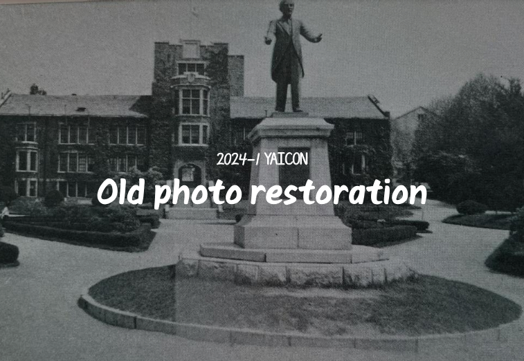
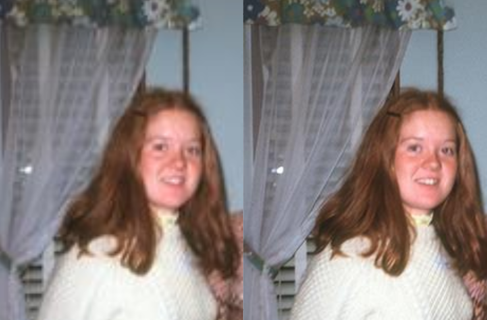

# Old-photo-restoration Using IGNN



## Datasets

1. Download dataset
dataset link: https://huggingface.co/datasets/biglam/dating-historical-color-images

2. Datasetmaker
```
python ./datasets/datasetmaker.py
```
## Dependencies and Installation

1 Create conda environment.
```
conda create --name ignn python=3.8 
conda activate ignn
conda install pytorch=1.1.0 torchvision=0.3.0 cudatoolkit=9.0 -c pytorch
```

2 Install PyInn.
```
pip install git+https://github.com/szagoruyko/pyinn.git@master
```

3 Install matmul_cuda.
```
bash install.sh
```

4 Install other dependencies.
```
pip install -r requirement_new.txt
```

## Model weight

Pretrained Models
link: https://drive.google.com/file/d/1LN5ZPzkNs7xA2mv2Nq7dE3a0A5owjj9p/view?usp=sharing   and put them into ./ckpt

## Test
```
python runner.py \
        --gpu [gpu_id]\
        --phase 'test'\
        --weights './ckpt/OldImage_x2.pth'\
        --scale [2/3/4]\
        --demopath [test folder path]\
        --testname 'Demo'\
        --out [output path]
```

## Output



## Acknowledgements
This project is based on https://github.com/sczhou/IGNN.
```
@inproceedings{zhou2020cross,
title={Cross-scale internal graph neural network for image super-resolution},
author={Zhou, Shangchen and Zhang, Jiawei and Zuo, Wangmeng and Loy, Chen Change},
booktitle={Advances in Neural Information Processing Systems},
year={2020}
}
```
